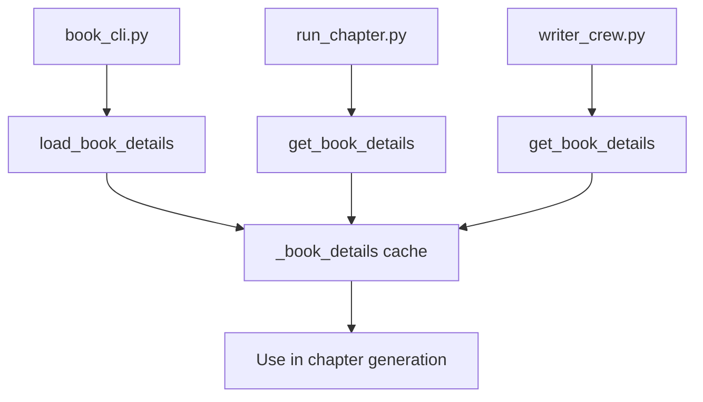

# Book Details Implementation Plan

## Todo Task Information

Add this task to your `project_workbench/todos.json` file:

```json
{
  "id": "TASK-7",
  "title": "Implement Book Details Module for Title and Subtitle",
  "description": "Create a centralized book details module that loads the book title and subtitle from the outline JSON file once and makes them available throughout the application. This will ensure consistent display of book metadata in all generated content. See project_workbench/book_details_implementation_plan.md for detailed implementation instructions.",
  "status": "TODO",
  "priority": "MEDIUM",
  "assignee": "dev",
  "created": "2025-05-21",
  "updated": "2025-05-21",
  "due": "2025-06-04",
  "tags": ["enhancement", "architecture", "book-metadata"]
}
```

## Problem Statement
Currently, the book outline is loaded from JSON in several places in the code, but the title and subtitle are not being extracted and saved for use throughout the app. We need to modify the code to extract these details upon first load of the outline and make them available throughout the application.

## Current State Analysis
1. The book outline is loaded in multiple places:
   - In `book_cli.py`:
     - `extract_chapter_from_outline` function (lines 48-87)
     - `generate_full_outline_and_extract_chapter` function (lines 116-148)
     - In the `flow` command handler (lines 256-284)
   - In `run_chapter.py`:
     - `run_single_chapter` function (lines 52-68)
   - In `writer_crew.py`:
     - `research_topic` method (lines 163-176)
     - `write_chapter_task.execute` method (lines 348-370)

2. The JSON outline contains `title`, `subtitle`, and `total_chapters` fields at the root level.

3. The markdown outline already includes the title and subtitle in the first line: `# Book Outline: ChatGPT for Business - How to Create Powerful AI Workflows`

## Proposed Solution

### 1. Create a Book Details Module
Create a new module `src/book_writing_flow/utils/book_details.py` that will handle loading and storing book details:

```python
#!/usr/bin/env python
import os
import json
import logging
from functools import lru_cache
from typing import Dict, Any, Optional

# Configure logging
logger = logging.getLogger(__name__)

# Global book details cache
_book_details = {
    "title": "",
    "subtitle": "",
    "total_chapters": 0
}

@lru_cache(maxsize=1)
def load_book_details() -> Dict[str, Any]:
    """
    Load book details from the outline JSON file and cache them.
    Returns a dictionary with title, subtitle, and total_chapters.
    """
    global _book_details
    
    try:
        # First try to load from output/outlines directory
        if os.path.exists("output/outlines/book_outline.json"):
            with open("output/outlines/book_outline.json", 'r') as f:
                outline = json.load(f)
                logger.info("Loaded book details from output/outlines/book_outline.json")
        # Fall back to root directory if not found in output/outlines
        elif os.path.exists("book_outline.json"):
            with open("book_outline.json", 'r') as f:
                outline = json.load(f)
                logger.info("Loaded book details from book_outline.json")
        else:
            logger.warning("book_outline.json not found in output/outlines or root directory")
            return _book_details
        
        # Extract book details
        _book_details["title"] = outline.get("title", "")
        _book_details["subtitle"] = outline.get("subtitle", "")
        _book_details["total_chapters"] = outline.get("total_chapters", 0)
        
        logger.info(f"Loaded book details: {_book_details}")
    except Exception as e:
        logger.error(f"Error loading book details: {e}")
    
    return _book_details

def get_book_details() -> Dict[str, Any]:
    """
    Get the cached book details or load them if not already loaded.
    """
    global _book_details
    
    if not _book_details["title"]:
        return load_book_details()
    
    return _book_details

def get_full_book_title() -> str:
    """
    Get the full book title (title - subtitle).
    """
    details = get_book_details()
    title = details["title"]
    subtitle = details["subtitle"]
    
    if subtitle:
        return f"{title} - {subtitle}"
    return title
```

### 2. Update book_cli.py
Modify `book_cli.py` to use the book details module:

```python
# Add import at the top
from src.book_writing_flow.utils.book_details import load_book_details, get_book_details

# In main() function, after ensure_output_dirs()
def main():
    # ...
    # Ensure output directories exist
    ensure_output_dirs()
    
    # Load book details early in the process
    load_book_details()
    # ...
```

### 3. Update run_chapter.py
Modify `run_chapter.py` to use the book details module:

```python
# Add import at the top
from src.book_writing_flow.utils.book_details import get_book_details, get_full_book_title

# In run_single_chapter function, after loading the outline
def run_single_chapter(chapter_index=0, force_regenerate=False):
    # ...
    # Load the outline from output/outlines directory
    try:
        # ...
        # Load book details for use throughout the app
        book_details = get_book_details()
        logging.info(f"Loaded book details: {book_details}")
    # ...
    
    # When creating the task, include book details
    task = write_chapter_task(
        # ...
        inputs={
            # ...
            "book_title": book_details["title"],
            "book_subtitle": book_details["subtitle"],
            # ...
        }
    )
```

### 4. Update writer_crew.py
Modify `writer_crew.py` to use the book details module:

```python
# Add import at the top
from src.book_writing_flow.utils.book_details import get_book_details, get_full_book_title

# In write_chapter_task.execute method, when generating chapter introduction
def execute(self):
    # ...
    # Get book details
    book_details = get_book_details()
    
    # Generate a brief chapter introduction with book title and subtitle
    full_book_title = get_full_book_title()
    chapter_intro = f"# {chapter_title}\n\nFrom the book \"{full_book_title}\"\n\nThis chapter explores {chapter_title.split(':')[-1].strip()}.\n\n"
    # ...
```

### 5. Update the Markdown Generation
Ensure the title and subtitle are included in the markdown output:

```python
# In run_chapter.py, when saving the chapter
with open(chapter_file, "w") as f:
    full_book_title = get_full_book_title()
    f.write(f"# {chapter.title}\n\n")
    f.write(f"From the book \"{full_book_title}\"\n\n")
    f.write(chapter.content + "\n\n")
```

## Implementation Flow
1. Create the `book_details.py` module
2. Update `book_cli.py` to load book details early
3. Update `run_chapter.py` to use the book details
4. Update `writer_crew.py` to include book details in chapter generation
5. Test the changes by generating a chapter and verifying the title and subtitle are included

## Diagram


## Benefits
1. Book details are loaded once and cached for efficiency
2. Details are available throughout the application
3. Consistent formatting of book title and subtitle in all outputs
4. Improved maintainability by centralizing the book details loading logic